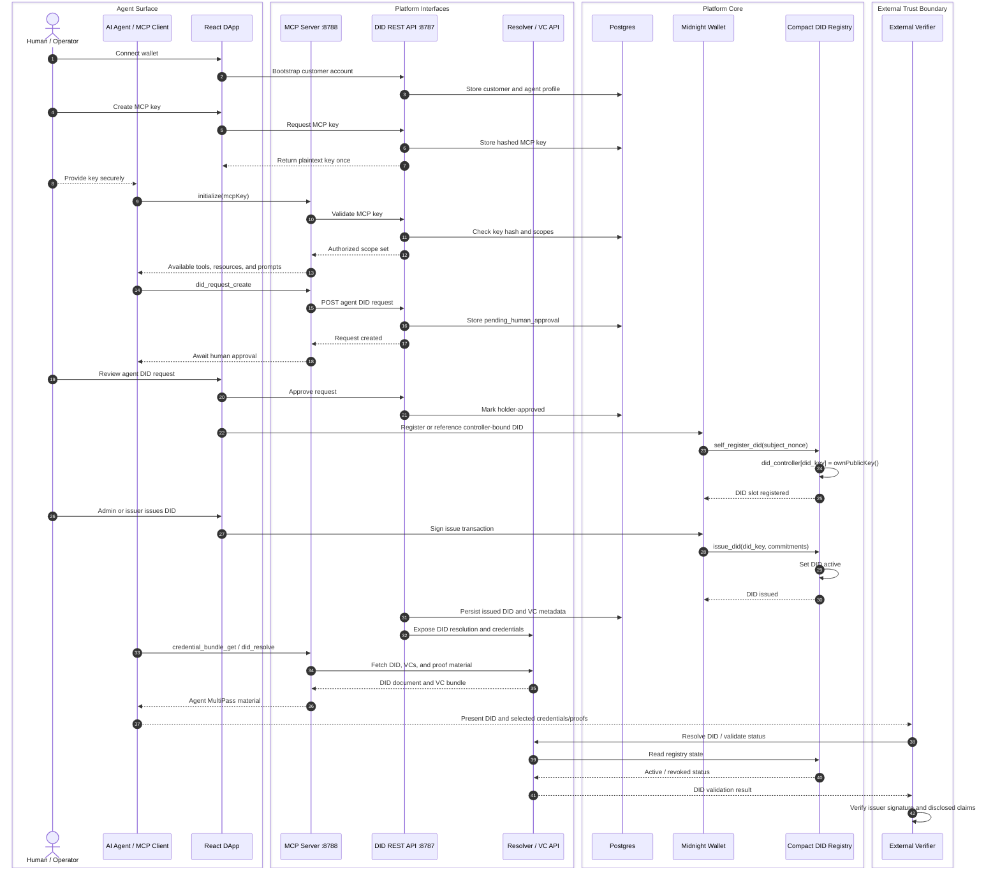

# Agent Platform Interface Sequence

This diagram shows the agent-facing platform flow as a sequence architecture.
The vertical lifelines separate the external actor surfaces, platform interfaces,
platform core, Midnight registry boundary, and external verification boundary.

